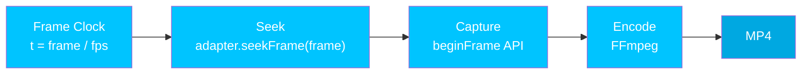

Hyperframes is built around a core guarantee: **the same [composition](/concepts/compositions) always produces the same video**. This is what makes automated pipelines, CI testing, and AI-driven workflows reliable.

## How It Works

The rendering pipeline is frame-by-frame and seek-driven. No realtime playback is involved -- every frame is independently seeked and captured.

<Steps>
  <Step title="Frame clock">
    The [engine](/packages/engine) computes the time for each frame using integer math: `time = floor(frame) / fps`. There is no wall-clock dependency -- rendering is entirely decoupled from real time.
  </Step>
  <Step title="Seek">
    The [frame adapter](/concepts/frame-adapters) receives a `seekFrame(frame)` call and deterministically positions all animations, DOM state, and canvas content to the exact frame. The adapter's `renderSeek` pauses all [GSAP](/guides/gsap-animation) timelines and seeks them to the computed time.
  </Step>
  <Step title="Capture">
    Chrome's `HeadlessExperimental.beginFrame` API captures the pixel buffer for the current frame. This is a single, atomic operation -- no partial paints or race conditions.
  </Step>
  <Step title="Encode">
    FFmpeg encodes the captured frames into the final MP4 video. Audio tracks from `<audio>` and `<video>` elements are mixed in during this stage.
  </Step>
</Steps>



## What Makes It Deterministic

- **No wall-clock dependencies** -- rendering does not use `Date.now()`, `requestAnimationFrame`, or system timers
- **No unseeded randomness** -- `Math.random()` without a seed breaks determinism
- **No render-time network fetches** -- all assets must be loaded before rendering starts
- **Fixed output parameters** -- `fps`, `width`, and `height` are locked before the first frame
- **Finite duration** -- every [composition](/concepts/compositions) has a known, finite length

These same rules apply to every [frame adapter](/concepts/frame-adapters). If you are building a custom adapter, you must follow the [determinism contract](/concepts/frame-adapters#determinism-contract).

## Docker Mode

For maximum reproducibility, render in Docker:

```bash
npx hyperframes render --docker -o output.mp4
```

Docker mode uses an exact Chrome version and font set, ensuring:
- Same Chromium rendering engine across all platforms
- Same system fonts (no platform-specific font substitution)
- Same FFmpeg encoder version

See the [Rendering guide](/guides/rendering) for all rendering options.

## Preview vs. Render Parity

The browser preview and the rendered MP4 should match. Hyperframes achieves this through:

- **One runtime** -- the same `hyperframe.runtime` drives both preview and render
- **Producer-canonical behavior** -- the [producer's](/packages/producer) seek semantics are the source of truth
- **Readiness gates** -- `__playerReady` and `__renderReady` ensure the [composition](/concepts/compositions) is fully loaded before any frame is captured

<Note>
  Local rendering (without Docker) may show slight differences due to platform-specific font rendering and Chrome version. Use Docker mode when exact reproducibility matters.
</Note>

## For Adapter Authors

If you are building a [frame adapter](/concepts/frame-adapters), your adapter must follow the determinism contract:

- `seekFrame(frame)` must be idempotent -- same frame, same result
- No side effects that depend on call order (must handle random access)
- No async operations that resolve after the frame is "committed"
- Clean lifecycle: `init` -> `seekFrame` (N times) -> `destroy`

## Next Steps

<CardGroup cols={2}>
  <Card title="Frame Adapters" icon="plug" href="/concepts/frame-adapters">
    Build adapters that uphold the determinism contract
  </Card>
  <Card title="Rendering" icon="film" href="/guides/rendering">
    Render to MP4 locally or in Docker
  </Card>
  <Card title="@hyperframes/producer" icon="clapperboard" href="/packages/producer">
    The full rendering pipeline that orchestrates deterministic output
  </Card>
  <Card title="Common Mistakes" icon="triangle-exclamation" href="/guides/common-mistakes">
    Pitfalls that break determinism and how to avoid them
  </Card>
</CardGroup>
